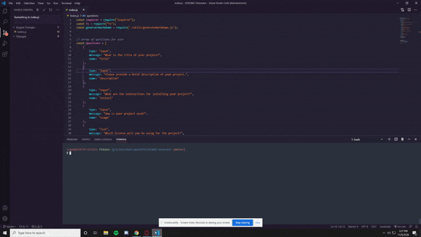

# Readme Generator 
***
   

### Table of Contents
* [Description](#Description)
* [Installation](#Installation)
* [Usage](#Usage)
* [License](#License)
* [Contribution](#Contribution)
* [Tests](#Tests)
* [Questions](#Questions)
---
   
### Description 
This project generates a readme file
   
---
   
### Installation 
to install this project download the files and use the command node index.js in your terminal
   
---
   
### Usage 
The project is used to generate a readme for any project using a command line interface
   
---
   
### License 
This project is covered under the MIT license

---
   
### Contribution 
Others can contribute by forking the project and then submiting a pull request for approval
   
---
   
### Tests 
There are no tests for this project
   
---
   
### Questions 

[brendonstahl97](https://github.com/brendonstahl97)

brendonstahl97@gmail.com
   
---